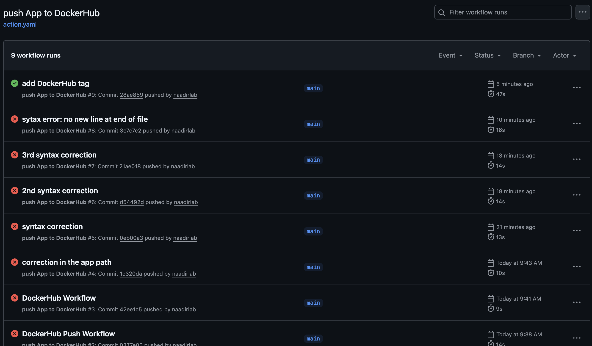
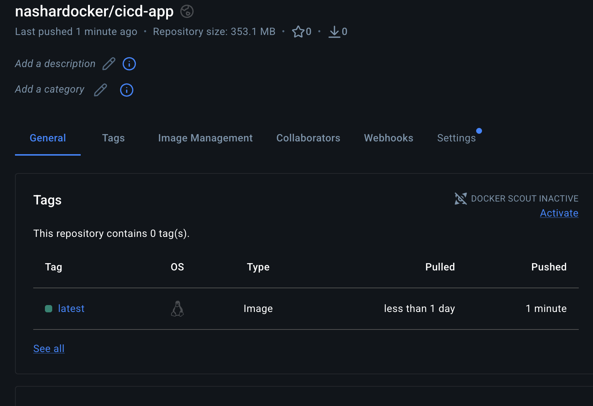

# CI pipeline with automated Docker image delivery to Docker Hub

This is a simple Flask application deployed via **Docker** and automated with **GitHub Actions**.  
The goal of this project is to demonstrate a basic **CI workflow** that builds, lints, and pushes a Docker image to Docker Hub.

---

## Application
A simple Flask app that returns a welcome message:

```python
@app.route('/')
def first_pipeline():
    return 'Welcome to my first CI/CD Pipeline!'
```

- Runs on: 0.0.0.0:5002 
- Dependencies: Flask 2.3.2

## Dockerfile
- Uses python:3.8-bullseye as base
- Installs required system packages for Python
- Installs Python dependencies from requirements.txt
- Exposes port 5002
- Runs the Flask app

## CI/CD Pipeline
GitHub Actions workflow (action.yaml) automates the following steps:
1. Checkout Repository
    - Uses actions/checkout@v5 to get the code.
2.	Linting
    - Installs flake8 and checks Python code style in app/app.py.
3.	DockerHub Login
	- Uses docker/login-action with secrets DOCKERHUB_USERNAME and DOCKERHUB_TOKEN.
4.	Build and Push Docker Image
	- Uses docker/build-push-action
	- Builds Docker image from Dockerfile
	- Tags it as nashardocker/cicd-app
	- Pushes it to Docker Hub

Successful pipeline after debugging syntax errors:


Pushed Docker image on DockerHub:


## Key Learnings
- Built and containerized a simple Python Flask application with Docker  
- Created a CI pipeline using GitHub Actions  
- Implemented automated linting with flake8 to ensure code quality  
- Built and pushed Docker images automatically to Docker Hub  